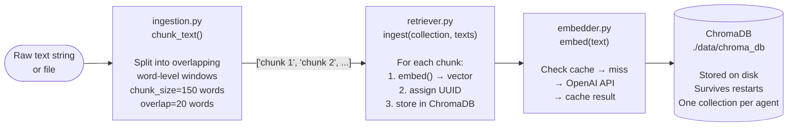

# Mini RAG Agent

An educational Retrieval-Augmented Generation (RAG) service built with FastAPI and OpenAI.  
The codebase is deliberately layered so each file maps to a real concept in production AI systems.

---

## What It Does

A user sends a question → the system picks the right AI agent → retrieves relevant facts from a knowledge base → injects those facts plus the user's conversation history into a prompt → streams the LLM's answer back.

---

## Project Structure

```
src/
├── main.py                   # HTTP layer — endpoints, startup, pipeline wiring
├── config.py                 # All settings (env vars with defaults)
├── requirements.txt
│
├── agents/
│   ├── registry.py           # Agent definitions (name, prompt, keywords, collection)
│   └── selector.py           # Routing logic: keyword match → LLM match → fallback
│
├── rag/
│   ├── embedder.py           # text → vector via OpenAI Embeddings API (+ cache)
│   ├── ingestion.py          # raw text → chunks → calls retriever.ingest()
│   └── retriever.py          # ChromaDB repository: ingest() and retrieve()
│
├── llm/
│   ├── provider.py           # Prompt assembly, token trimming, tool loop, streaming
│   └── tools.py              # Tool definitions + execute_tool() dispatcher
│
├── conversation/
│   ├── history.py            # Per-conversation message store (SQLite)
│   └── memory.py             # Long-term per-user memory (SQLite + cosine search)
│
├── middleware/
│   ├── auth.py               # X-API-Key header validation (FastAPI dependency)
│   ├── errors.py             # Global exception → clean JSON error response
│   └── metrics.py            # Prometheus counters/histograms + /metrics endpoint
│
└── utils/
    ├── cache.py              # In-memory TTL cache (embeddings + routing)
    └── logger.py             # Structured JSON logger
```

---

## Architecture — Three Tiers

| Tier | What it adds |
|------|-------------|
| **Tier 1** | Auth, persistent storage (SQLite + ChromaDB on disk), structured error responses |
| **Tier 2** | Tool calling, long-term user memory, token budget management |
| **Tier 3** | Prometheus metrics, routing cache, embedding cache |

---

## Full Request Pipeline

Every `POST /chat` or `POST /chat/stream` request flows through the same 8 steps:

```
① Auth check
② Agent selection
③ RAG retrieval
④ Memory search
⑤ History load
⑥ LLM call (with tool loop)
⑦ Save history
⑧ Extract memory (async)
```

### Method-to-Method Flow

```mermaid
flowchart TD
    Client(["Client\n(curl / Postman)"])

    Client -->|"POST /chat\nX-API-Key header"| Auth

    subgraph middleware["Middleware (runs before handler)"]
        Auth["auth.py\nverify_api_key()\n\nChecks X-API-Key header\nagainst config.API_KEY"]
        Metrics["metrics.py\ntrack_requests()\n\nStarts latency timer,\nincrements active gauge"]
    end

    Auth --> Metrics
    Metrics --> Handler

    subgraph main["main.py — _run_pipeline()"]
        Handler["① Receive ChatRequest\n{question, conversation_id, user_id}"]
        Handler --> Selector

        subgraph routing["Agent Selection — agents/selector.py"]
            Selector["select_agent(question)"]
            Selector -->|"check routing_cache.get(question)"| CacheHit{Cache hit?}
            CacheHit -->|"Yes → skip LLM call"| AgentResult
            CacheHit -->|No| KeywordMatch

            KeywordMatch["_keyword_match()\n\nScans agent keywords list\nfor matches in question"]
            KeywordMatch -->|matched| AgentResult
            KeywordMatch -->|no match| LLMMatch

            LLMMatch["_llm_match()\n\ngpt-4o-mini picks the best agent\nfrom registry descriptions"]
            LLMMatch --> AgentResult

            AgentResult["returns (agent_config, match_type)\nrouting_cache.set(question, value=agent_name)"]
        end

        AgentResult --> Retrieve

        subgraph rag["RAG Retrieval — rag/retriever.py + rag/embedder.py"]
            Retrieve["retrieve(collection, question)"]
            Retrieve --> EmbedQ["embedder.embed(question)\n\nCheck embedding_cache first\nOn miss: call OpenAI Embeddings API\nCache result for 24h"]
            EmbedQ --> ChromaQuery["chromadb.collection.query()\n\nCosine similarity search\nReturns top-K closest chunks"]
            ChromaQuery --> Facts["list of fact strings\n(injected into LLM prompt)"]
        end

        Facts --> MemSearch

        subgraph memory["Long-term Memory — conversation/memory.py"]
            MemSearch["search_memories(user_id, question)\n\nEmbed question → cosine similarity\nagainst all stored user memories\nReturn top-3 above threshold 0.75"]
        end

        MemSearch --> HistLoad

        subgraph history["Conversation History — conversation/history.py"]
            HistLoad["get_history(conversation_id)\n\nSELECT last 10 messages\nfrom SQLite, ordered oldest-first"]
        end

        HistLoad --> LLMCall
    end

    subgraph provider["LLM Call — llm/provider.py"]
        LLMCall["stream_answer(agent, facts, memories, history, question)"]
        LLMCall --> BuildMsg["_build_messages()\n\nAssembles messages array:\n[system: prompt + facts + memories]\n[history messages...]\n[user: question]"]
        BuildMsg --> TrimHist["_trim_history_to_budget()\n\nCount tokens with tiktoken\nDrop oldest messages until\ntotal fits within BUDGET_HISTORY"]
        TrimHist --> FirstCall["1st LLM call (non-streaming)\nwith tools=TOOLS\n\nLLM decides: answer now OR call a tool"]
        FirstCall --> ToolCheck{Tool calls\nrequested?}

        ToolCheck -->|"Yes"| ExecTool["tools.execute_tool(name, args)\n\nDispatches to:\n• get_current_datetime()\n• calculate(expression)\n• count_words(text)"]
        ExecTool --> AppendResult["Append tool result as\n{role: 'tool', content: result}"]
        AppendResult --> SecondCall["2nd LLM call (streaming)\nNow LLM has tool result as context"]

        ToolCheck -->|"No — answered directly"| YieldDirect["yield first_msg.content\nReturn immediately"]
        SecondCall --> YieldStream["yield tokens one by one\nas they arrive from OpenAI"]
    end

    YieldStream --> SaveHist
    YieldDirect --> SaveHist

    subgraph persist["Persistence — conversation/history.py + memory.py"]
        SaveHist["add_message(conv_id, 'user', question)\nadd_message(conv_id, 'assistant', answer)\n\nINSERT INTO messages (SQLite)"]
        SaveHist --> MemExtract["maybe_extract_and_store()\n[runs in background thread]\n\nAsk gpt-4o-mini to extract\nmemorable facts from this turn\nStore each fact as a memory vector"]
    end

    SaveHist --> Response
    Response(["ChatResponse JSON\n{answer, agent_used, match_type,\nconversation_id, facts_retrieved}"])
```



---

## RAG Ingestion Flow

How documents get into the knowledge base (called on startup and via `POST /ingest`):



**Why overlap?**  
When splitting text, the answer to a question might straddle a chunk boundary. Overlap ensures the context around each boundary appears in at least one complete chunk.

---

## Conversation Memory vs History

| | History | Memory |
|---|---------|--------|
| **Scope** | Per conversation session | Per user, across all sessions |
| **Storage** | SQLite `messages` table | SQLite `memories` table |
| **Lifespan** | Until `DELETE /conversation/{id}` | Permanent |
| **Content** | Full message turns (role + content) | Extracted facts ("user prefers Python 3.11") |
| **Retrieved by** | `conversation_id` lookup | Cosine similarity search against current question |
| **Injected into** | History section of prompt | "WHAT I KNOW ABOUT YOU" section of system prompt |

---

## Token Budget

Each LLM call is divided into named budgets (configured in `config.py`):

```
Total context: 12,000 tokens
├── System prompt:    1,500  (agent identity)
├── RAG facts:        3,000  (retrieved chunks)
├── User memory:        500  (long-term facts)
├── History:          4,000  (trimmed oldest-first to fit)
└── Answer (max_tokens): ~3,000  (remaining budget for LLM response)
```

If conversation history exceeds 4,000 tokens, `_trim_history_to_budget()` drops the oldest messages until it fits.

---

## Caching

| Cache | Key | TTL | Why |
|-------|-----|-----|-----|
| `embedding_cache` | text string | 24h | Embeddings are deterministic — same text always produces same vector |
| `routing_cache` | question string | 5 min | Avoids an LLM call for repeated questions; short TTL in case agent registry changes |

---

## API Endpoints

All endpoints except `/health` and `/metrics` require the header `X-API-Key: dev-secret-key-change-me`.

| Method | Path | Description |
|--------|------|-------------|
| `POST` | `/chat` | Full pipeline, returns complete JSON response |
| `POST` | `/chat/stream` | Full pipeline, streams tokens as Server-Sent Events |
| `POST` | `/ingest` | Add a document to an agent's knowledge collection |
| `DELETE` | `/conversation/{id}` | Clear conversation history for a session |
| `GET` | `/cache/stats` | View hit rates for embedding and routing caches |
| `GET` | `/health` | Liveness check — returns `{"status": "ok"}` |
| `GET` | `/metrics` | Prometheus scrape endpoint |

### Example — Chat

```bash
curl -X POST http://localhost:8000/chat \
  -H "Content-Type: application/json" \
  -H "X-API-Key: dev-secret-key-change-me" \
  -d '{"question": "How do I create a Python virtual environment?"}'
```

### Example — Ingest a document

```bash
curl -X POST http://localhost:8000/ingest \
  -H "Content-Type: application/json" \
  -H "X-API-Key: dev-secret-key-change-me" \
  -d '{
    "collection": "python_docs",
    "text": "Python f-strings allow inline expressions: f\"Hello {name}\".",
    "source": "manual"
  }'
```

---

## Setup

```bash
# 1. Create and activate a virtual environment
python3 -m venv venv
source venv/bin/activate

# 2. Install dependencies
pip install -r src/requirements.txt

# 3. Set your OpenAI API key
echo "OPENAI_API_KEY=sk-your-key-here" > src/.env

# 4. Start the server
cd src
python3 main.py
```

The server starts on `http://localhost:8000`.  
Interactive API docs are available at `http://localhost:8000/docs`.

---

## Tools Available to the LLM

When the LLM decides a tool is needed, it returns a tool call instead of text. The server executes the tool and feeds the result back before streaming the final answer.

| Tool | What it does |
|------|-------------|
| `get_current_datetime` | Returns current UTC timestamp |
| `calculate` | Evaluates arithmetic expressions safely (no builtins) |
| `count_words` | Counts words in a given string |
